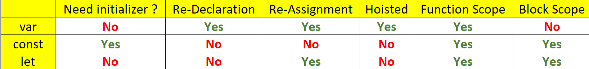

# JavaScript - Basics 1

## Table of contents

- [JavaScript - Basics 1](#javascript---basics-1)
  - [Table of contents](#table-of-contents)
  - [如何在 html 檔案中使用 JavaScript ?](#如何在-html-檔案中使用-javascript-)
  - [1. 常見 Js 函數](#1-常見-js-函數)
  - [2. Variables in Js](#2-variables-in-js)
  - [3. Numbers Operators](#3-numbers-operators)
  - [4. Strings](#4-strings)
    - [文字字串 Text string](#文字字串-text-string)
    - [數字字串 Number string](#數字字串-number-string)
  - [5. Comments](#5-comments)
  - [6. Primitive Data Types](#6-primitive-data-types)
    - [6.1 Number](#61-number)
    - [6.2 String](#62-string)
    - [6.3 Boolean](#63-boolean)
    - [6.4 Undefined](#64-undefined)
    - [6.5 Null](#65-null)
    - [6.6 Symbol](#66-symbol)

## 如何在 html 檔案中使用 JavaScript ?

創建一個 `.js` 檔案，範例為 `test.js`

到 `.html` 檔案中的 `<body>` tag 下面加上

```html
<script src="test.js"></script>
```

即可完成 html 檔案與 js 檔案的串接

## 1. 常見 Js 函數

| Function Name   | Description  |
| --------------- | ------------ |
| `console.log()` | 輸出內容     |
| `alert()`       | 警語提示     |
| `prompt()`      | 讓使用者輸入 |

## 2. Variables in Js

`=` : be used to assign value to varaible.



## 3. Numbers Operators

| Operators Name         |
| ---------------------- |
| `+`, `-`, `*`, `/`     |
| `%`                    |
| `**`                   |
| `++`, `--`             |
| `+=`, `-=`, `*+`, `/=` |

## 4. Strings

### 文字字串 Text string

使用 `+` 做字串串接

沒辦法像 python 一樣使用 `*` ，也不能使用 `-` 、 `/`

### 數字字串 Number string

由上而下，由左而右。String `+` Number 會把 Number 變成 String 再做 concat。

**String type + Number type ⇒ String type**

## 5. Comments

1. `//` : one line comments
2. `/* */` : multiple lines comments
3. 先輸入 `/**` 再按空格， VSCode 會自動補齊 `*/` : multiple lines comments in VSCode

小功能：將要設為 comments 的行全部選取按 `ctrl + /` 就可以全部 comment

## 6. Primitive Data Types

Primitive data types with common functions or other easy things

### 6.1 Number

| Function Name | Description                                           |
| ------------- | ----------------------------------------------------- |
| `.toString()` | 回傳 string 型別。filter 效果，不改變原變數之型態     |
| `toFixed()`   | 小數點選保留位數。filter 效果，不改變原變數之型態與值 |

### 6.2 String

| Properties & Functions | Description                                        |
| ---------------------- | -------------------------------------------------- |
| `.length`              | 取得字串長度， length is a string’s property       |
| `[]`                   | 可以透過 index 來 retrieve characters              |
| `.slice(start, end)`   | 包含 start 不包含 end                              |
| `indexOf()`            | 回傳第一個找到的 substring 的 index，沒找到回傳 -1 |
| `toLowerCase()`        | 全變小寫                                           |
| `toUpperCase()`        | 全變大寫                                           |
| `split()`              | 可以切割 string 成 array                           |
| `Number()`             | 字串變成 number                                    |

### 6.3 Boolean

`true` or `false`

### 6.4 Undefined

沒有被 assigned 值的變數 ⇒ `undefined`, memory box is waiting for assignment.

### 6.5 Null

There’s "_nothing_" in the box. noting means `null`.

跟 `undefined` 的差別在於前者是一個 memory box 裡面沒東西，一個有 `null`

### 6.6 Symbol

表示獨一無二的值
